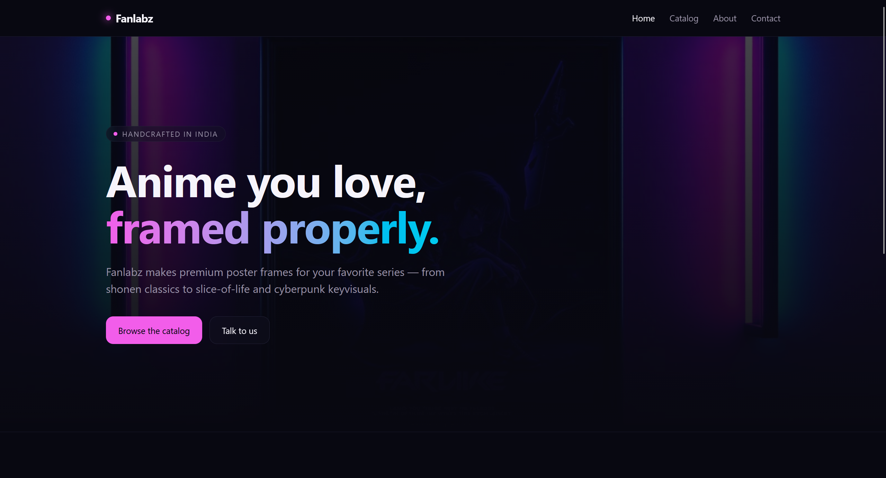
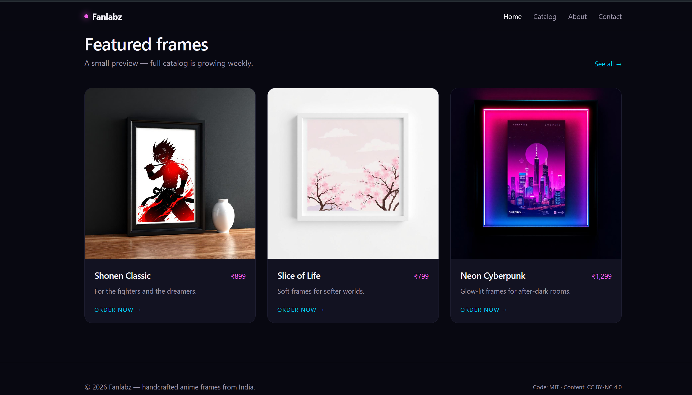
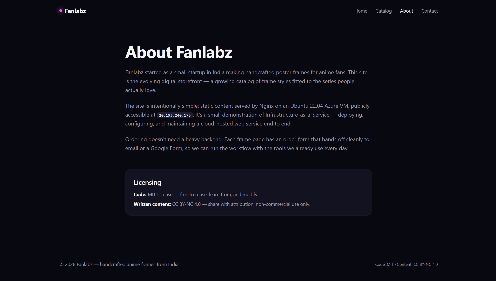

# Fanlabz — Handcrafted Anime Poster & 3D LED Frames

**Anime you love, framed properly. A cloud-hosted e-commerce storefront and order-request platform built on Microsoft Azure IaaS.**

[](https://ubuntu.com/)
[](https://azure.microsoft.com/)
[](https://bun.sh/)
[](https://nginx.org/)
[](https://letsencrypt.org/)
[](https://www.mysql.com/)

Fanlabz originated as a small startup in India, crafting premium, built-to-order poster frames and 3D LED Frames for anime collectors. This repository documents the deployment of Fanlabz's evolving digital storefront for the **ICT171 Introduction to Server Environments and Architectures** Cloud Server Project.

The platform allows users to browse featured frame collections (Shonen Classic, Slice of Life, and Neon Cyberpunk), inspect sizing specifications, and submit structured order requests without relying on intermediate third-party SaaS checkout builders. Behind the live web storefront, the Linux server runs automated MySQL database backups via **Bash scripting** and a terminal-based **Python CLI inventory manager** to track frame stock.

---

## Academic Information

| Item | Details |
| :--- | :--- |
| **Unit** | ICT171 Introduction to Server Environments and Architectures |
| **Assessment** | Assignment 3: Cloud Server Project & Video Explainer |
| **Student Name** | Harkavya Teja |
| **Student ID** | `36159939` |
| **Cloud Platform** | Microsoft Azure (Infrastructure as a Service — IaaS) |
| **Deployment Date** | July 2026 |

---

## Video Explainer

Watch the full ICT171 Fanlabz server architecture walkthrough, script execution demonstration, and live website review:

> 🎥 **[Insert Video Explainer Link Here — YouTube / Google Drive]**
> *(Video link will be updated upon final project submission)*

---

## Live Cloud Deployment Summary

| Item | Value |
| :--- | :--- |
| **Primary Domain (HTTPS)** | [https://fanlabz.shop/](https://fanlabz.shop/) |
| **Subdomain (WWW)** | [https://www.fanlabz.shop/](https://www.fanlabz.shop/) |
| **Public IP Address** | `20.193.240.175` |
| **DNS Registrar** | GoDaddy |
| **Operating System** | Ubuntu Server 22.04 LTS (x64) |
| **Cloud Region** | Microsoft Azure |
| **Web Server Stack** | Nginx Reverse Proxy → Bun Runtime / Nitro Server Engine (Port `3000`) |
| **Database Engine** | MySQL 8.0 (`fanlabz_inventory`) |
| **Back-Office Scripts** | Bash Automated Backup (`backup_inventory.sh`) + Python CLI (`inventory_manager.py`) |

---

## Website & Storefront Preview

The Fanlabz digital storefront is designed with a dark, neon-lit visual identity tailored to anime and cyberpunk aesthetics:

### 1. Storefront Hero Section

*The landing page welcoming collectors to browse handcrafted frames built in India.*

### 2. Featured Frame Catalog

*The growing catalog showcasing the different frame types currently available.*

### 3. Product Specification & Order Request Flow

*Detailed product view where users configure sizing and hand off order requests cleanly to their email app or Google Form.*

### 4. About & Contact Pages

[](docs/screenshots/contacts.png)
*Documenting the startup's origin and the IaaS cloud server architecture.*

---

## Why IaaS & Burstable Cloud Sizing?

### IaaS vs. SaaS

This project is deployed using **Infrastructure as a Service (IaaS)** on Microsoft Azure rather than Software as a Service (SaaS) platforms like Wix or Shopify. While SaaS platforms obscure server management, IaaS grants full administrative (`sudo` / SSH) control over the Linux virtual machine. This raw OS access was mandatory to:

* Standardize a modern **Bun + Vite + Nitro** SSR JavaScript stack.
* Implement Linux kernel-level memory management (`swapspace`) and persistent background process daemons (`systemd`).
* Build back-office database administration scripts natively using Linux `cron`, Bash, and Python 3.

### Pragmatic Cloud Sizing: Standard B2ts (1 vCPU, 2 GiB RAM)

I provisioned an Azure **Standard B2ts / B-series burstable virtual machine (1 vCPU, 2 GB RAM)**.

* **The Engineering Rationale:** Fanlabz is a fast, lightweight web storefront. Serving optimized assets and proxying requests to an asynchronous Bun server engine consumes minimal CPU overhead. Deploying enterprise-grade hardware (such as 4+ vCPUs or 16 GB RAM) would waste cloud credits. By configuring a **2 GB Linux swap file**, a 2 GB VM comfortably compiles frontend production bundles and runs MySQL 8.0 without performance degradation.

---

## Complete Cloud Deployment Guide (Chronological Rebuild)

The following step-by-step guide is documented so that any colleague or system administrator can rebuild the Fanlabz production server from scratch in under two hours.

---

### Phase 1: Claiming Free Azure Student Credits & Provisioning the VM

#### 1. Claiming $100 Student Cloud Credits

1. Visit the [Microsoft Azure for Students](https://azure.microsoft.com/en-us/free/students/) portal.
2. Log in using your university academic email address (`36159939@student.murdoch.edu.au`).
3. Complete academic verification to unlock **$100 in free Azure credits** without needing a credit card.

#### 2. Creating the Azure Linux Virtual Machine

1. From the Azure Dashboard, select **Create a resource** → **Virtual Machine**.
2. Configure core deployment parameters:
   * **Resource Group:** `ICT171-Fanlabz-RG`
   * **Virtual Machine Name:** `Fanlabz-Production-VM`
   * **Region:** Recommended closest latency zone (e.g., `UAE North` or `Japan East`)
   * **Image:** **Ubuntu Server 22.04 LTS (x64)**
   * **Size:** **Standard B2ts (1 vCPU, 2 GiB Memory)**
3. Under **Administrator Account**:
   * **Authentication Type:** Select **SSH public key** (or Password for simplified academic testing).
   * **Username:** `azureuser`
   * Save your generated `.pem` private key locally.

#### 3. Configuring the Network Security Group (Firewall Rules)

In the **Networking** tab, configure inbound port rules so the VM can communicate with the public internet:

| Port | Protocol | Action | Service | Description |
| :--- | :--- | :--- | :--- | :--- |
| `22` | TCP | Allow | SSH | Required for secure command-line terminal administration. |
| `80` | TCP | Allow | HTTP | Required for standard web access and Let's Encrypt SSL validation. |
| `443` | TCP | Allow | HTTPS | Required for secure, encrypted production e-commerce traffic. |

Click **Review + Create**. Azure will provision the VM and assign public IP: `20.193.240.175`.

---

### Phase 2: Connecting via SSH & Hardening Low-RAM Memory

#### 1. SSH Terminal Connection

Open your local terminal (PowerShell on Windows or Terminal on macOS/Linux):

```bash
# Secure private key permissions (macOS/Linux only)
chmod 400 your-key.pem

# SSH into the Azure Ubuntu instance
ssh -i "your-key.pem" azureuser@20.193.240.175
```

(Type `yes` when prompted to verify host authenticity).

#### 2. System Package Updates

Always patch OS packages to their latest security releases before installing web stacks:

```bash
sudo apt update && sudo apt upgrade -y
```

#### 3. Allocating Swap Space (OOM-Killer Protection)

> ⚠️ **P.S. Developer Note (Common Pitfall #1):**
> When compiling modern JavaScript/TypeScript applications (Vite, Nitro, Next.js) on VMs with 2 GB RAM or less, the Linux kernel's Out-Of-Memory (OOM) killer will frequently abort the build with a `Killed` message.
>
> **How I Solved It:** I allocated a 2 GB Swap File before running any builds, giving the server virtual memory breathing room.

```bash
# 1. Create a 2 GB swap file
sudo fallocate -l 2G /swapfile

# 2. Restrict permissions to root user only
sudo chmod 600 /swapfile

# 3. Format and activate swap space
sudo mkswap /swapfile
sudo swapon /swapfile

# 4. Make swap persistent across reboots
echo '/swapfile none swap sw 0 0' | sudo tee -a /etc/fstab

# 5. Verify available RAM + Swap
free -h
```

---

### Phase 3: Web Stack Standardization (Nginx Only)

> ⚠️ **P.S. Developer Note (Common Pitfall #2 — Apache vs. Nginx Conflict):**
> Many web tutorials advise installing Apache alongside Nginx. Doing so causes an immediate startup crash (`Address already in use: make_sock: could not bind to address [::]:80`) because both servers fight for HTTP Port 80.
>
> **How I Solved It:** I completely purged Apache (`sudo apt purge apache2 -y && sudo rm -rf /etc/apache2`) and standardized 100% on Nginx as the production reverse proxy.

```bash
# 1. Install core utilities, Nginx, MySQL Server, Git, and Python3 tools
sudo apt install nginx mysql-server git python3 python3-pip python3-venv unzip -y

# 2. Install Bun runtime system-wide
curl -fsSL https://bun.sh/install | bash
source ~/.bashrc

# 3. Install Certbot for automated Let's Encrypt HTTPS certificates
sudo apt install certbot python3-certbot-nginx -y
```

---

### Phase 4: Domain DNS Setup (GoDaddy)

I purchased the domain `fanlabz.shop` through GoDaddy. Inside the GoDaddy DNS Management panel, I pointed the domain to the Azure VM using two records:

| Record Type | Name / Host | Value / Points To | TTL | Purpose |
| :--- | :--- | :--- | :--- | :--- |
| A | `@` | `20.193.240.175` | 600s | Maps the root domain (`fanlabz.shop`) directly to the Azure VM. |
| CNAME | `www` | `@` | 600s | Redirects `www.fanlabz.shop` cleanly to the root domain. |

> ⚠️ **P.S. Developer Note (Common Pitfall #3 — GoDaddy CNAME Rule):**
> GoDaddy automatically provisions a default CNAME for `www`. If you try to add a duplicate A record for `www`, GoDaddy throws an error: `"Record name conflicts with another record named CNAME"`.
>
> **How I Solved It:** Keep the existing CNAME record (`www` → `@`) and only create the root `@` A-record.

---

### Phase 5: Deploying the Storefront & Systemd Automation

#### 1. Cloning & Compiling Production Files

```bash
# 1. Create web directory and grant ownership
sudo mkdir -p /var/www/ICT-171
sudo chown -R $USER:$USER /var/www/ICT-171

# 2. Clone the Fanlabz repository
git clone https://github.com/Harkavya/ICT-171.git /var/www/ICT-171
cd /var/www/ICT-171

# 3. Install dependencies and compile SSR build using Bun
bun install
bun run build
```

(Build artifacts output to `.output/public/` for static files and `.output/server/index.mjs` for the SSR server).

#### 2. Background Process Management (systemd)

To ensure Cloud Online Availability across reboots and disconnected SSH sessions, I registered the Bun server as a native Linux service:

```bash
sudo nano /etc/systemd/system/fanlabz.service
```

Service Configuration:

```ini
[Unit]
Description=Fanlabz Bun SSR E-Commerce Server
After=network.target

[Service]
Type=simple
User=root
WorkingDirectory=/var/www/ICT-171
ExecStart=/usr/local/bin/bun .output/server/index.mjs
Restart=always
RestartSec=5
Environment=NODE_ENV=production
Environment=PORT=3000

[Install]
WantedBy=multi-user.target
```

Enable and launch the daemon:

```bash
sudo systemctl daemon-reload
sudo systemctl enable fanlabz.service
sudo systemctl start fanlabz.service
sudo systemctl status fanlabz.service
```

---

### Phase 6: Nginx Reverse Proxy & Let's Encrypt SSL

#### 1. Nginx Production Configuration

I configured Nginx to serve static images and stylesheets directly from `.output/public/assets/` (for speed) while reverse-proxying all dynamic SSR order-request routes to Bun on Port 3000.

```bash
sudo nano /etc/nginx/sites-available/default
```

Replace the default file with:

```nginx
server {
    server_name fanlabz.shop www.fanlabz.shop;

    # Direct static asset delivery (bypasses SSR runtime for speed)
    location /assets/ {
        alias /var/www/ICT-171/.output/public/assets/;
        access_log off;
        expires 30d;
    }
    location /favicon.ico {
        alias /var/www/ICT-171/.output/public/favicon.ico;
        access_log off;
    }
    location /robots.txt {
        alias /var/www/ICT-171/.output/public/robots.txt;
        access_log off;
    }

    # Reverse-proxy dynamic traffic to Bun SSR server on Port 3000
    location / {
        proxy_pass http://127.0.0.1:3000;
        proxy_http_version 1.1;
        proxy_set_header Upgrade $http_upgrade;
        proxy_set_header Connection "upgrade";
        proxy_set_header Host $host;
        proxy_set_header X-Real-IP $remote_addr;
        proxy_set_header X-Forwarded-For $proxy_add_x_forwarded_for;
        proxy_set_header X-Forwarded-Proto $scheme;
        proxy_cache_bypass $http_upgrade;
    }

    listen 80;
    listen [::]:80;
}
```

Verify configuration and restart:

```bash
sudo nginx -t
sudo systemctl restart nginx
```

#### 2. Installing Let's Encrypt HTTPS Certificate

To secure transactions and achieve an A+ SSL Rating, request an automated certificate via Certbot:

```bash
sudo certbot --nginx -d fanlabz.shop -d www.fanlabz.shop
```

When prompted, enter your email address and select Option 2 (Redirect) to automatically force all unencrypted HTTP traffic to HTTPS.

---

## Server Administration Scripts (Rubric Scripting Component)

While the live website (`fanlabz.shop`) acts as the customer-facing storefront, I built two custom Linux server scripts to fulfill the ICT171 Scripting & Database Management Rubric:

1. A Bash Automated Database Backup System (`/usr/local/bin/backup_inventory.sh`).
2. A Python 3 Interactive Inventory CLI (`/usr/local/bin/inventory_manager.py`).

### 1. MySQL 8.0 Inventory Database Setup

I created a relational database named `fanlabz_inventory` to store the picture frame stock levels on the cloud VM.

```bash
# Log into MySQL root CLI
sudo mysql
```

```sql
-- 1. Create database and back-office user
CREATE DATABASE fanlabz_inventory;
CREATE USER 'inventory_user'@'localhost' IDENTIFIED BY 'StrongPassword123!';
GRANT ALL PRIVILEGES ON fanlabz_inventory.* TO 'inventory_user'@'localhost';
FLUSH PRIVILEGES;

-- 2. Create products inventory table
USE fanlabz_inventory;
CREATE TABLE products (
    id INT AUTO_INCREMENT PRIMARY KEY,
    name VARCHAR(100) NOT NULL,
    quantity INT NOT NULL,
    last_updated TIMESTAMP DEFAULT CURRENT_TIMESTAMP ON UPDATE CURRENT_TIMESTAMP
);

-- 3. Seed initial Fanlabz frame stock
INSERT INTO products (name, quantity) VALUES
('Custom Frame [20x30 cm] - Shonen Classic', 10),
('Resin Art [Customisable] - Slice of Life', 5),
('3D LED Frame [8x12 inches] - Neon Cyberpunk', 2);
EXIT;
```

### 2. Automated Database Backup Script (`backup_inventory.sh`)

My Bash script exports the MySQL database to a compressed `.sql.gz` archive, logs timestamps, and runs automatically every night via Linux cron.

> ⚠️ **P.S. Developer Note (Common Pitfall #4 — MySQL 8.0 Tablespace Error):**
> Running standard `mysqldump` on MySQL 8.0 often throws: `"Access denied; you need the PROCESS privilege for this operation when trying to dump tablespaces"`.
>
> **How I Solved It:** I added the `--no-tablespaces` flag to `mysqldump`. This safely ignores global tablespace queries while 100% preserving table schemas and stock data.

Script Source Code (`/usr/local/bin/backup_inventory.sh`):

```bash
#!/bin/bash
# ==============================================================================
# Script Name: backup_inventory.sh
# Description: Dumps 'fanlabz_inventory', compresses to .sql.gz, and logs date.
# ==============================================================================

TIMESTAMP=$(date +"%Y-%m-%d_%H-%M-%S")
BACKUP_DIR="/backups"
DB_NAME="fanlabz_inventory"
DB_USER="inventory_user"
DB_PASS="StrongPassword123!"
LOG_FILE="/backups/backup_log.txt"

# Create backup directory if it does not exist
mkdir -p "$BACKUP_DIR"

# Dump database using MySQL 8.0 safety flag
mysqldump --no-tablespaces -u "$DB_USER" -p"$DB_PASS" "$DB_NAME" > "$BACKUP_DIR/inventory_$TIMESTAMP.sql" 2>/dev/null

# Compress the dump file to conserve server disk storage
gzip "$BACKUP_DIR/inventory_$TIMESTAMP.sql"

# Append verification entry to backup log
echo "[$(date)] SUCCESS: Created archive inventory_$TIMESTAMP.sql.gz" >> "$LOG_FILE"
echo "Backup completed successfully -> $BACKUP_DIR/inventory_$TIMESTAMP.sql.gz"
```

Make executable and schedule daily nightly backup at 2:00 AM:

```bash
sudo chmod +x /usr/local/bin/backup_inventory.sh

# Register in user crontab
(crontab -l 2>/dev/null; echo "0 2 * * * /usr/local/bin/backup_inventory.sh") | crontab -
```

### 3. Interactive Python Inventory Manager (`inventory_manager.py`)

I developed a Python command-line dashboard that queries live database records using `mysql-connector-python` and formats terminal tables using `tabulate`. It automatically flags items with fewer than 5 units remaining and allows administrators to update quantities in real time.

```bash
# Install Python database and formatting dependencies
sudo apt install python3-pip -y
pip3 install mysql-connector-python tabulate
```

Script Source Code (`/usr/local/bin/inventory_manager.py`):

```python
#!/usr/bin/env python3
"""
==============================================================================
Script Name: inventory_manager.py
Description: Python CLI tool to inspect Fanlabz frame stock, highlight low
             inventory (< 5 units), and update item counts interactively.
==============================================================================
"""

import mysql.connector
from tabulate import tabulate

DB_CONFIG = {
    "host": "localhost",
    "user": "inventory_user",
    "password": "StrongPassword123!",
    "database": "fanlabz_inventory"
}

def get_connection():
    return mysql.connector.connect(**DB_CONFIG)

def display_inventory():
    conn = get_connection()
    cursor = conn.cursor()
    cursor.execute("SELECT id, name, quantity, last_updated FROM products")
    rows = cursor.fetchall()
    conn.close()

    table_data = []
    low_stock_alerts = []

    for row in rows:
        item_id, name, qty, updated = row
        status = "OK"
        if qty < 5:
            status = "⚠️ LOW STOCK"
            low_stock_alerts.append((name, qty))
        table_data.append([item_id, name, qty, status, str(updated)])

    print("\n========================= FANLABZ INVENTORY =========================")
    print(tabulate(table_data, headers=["ID", "Product Name", "Qty", "Status", "Last Updated"], tablefmt="grid"))
    print("=====================================================================\n")

    if low_stock_alerts:
        print("🚨 ATTENTION REQUIRED — LOW STOCK ITEMS:")
        for name, qty in low_stock_alerts:
            print(f"   -> {name}: Only {qty} remaining in stock!")
        print()

def update_quantity():
    display_inventory()
    try:
        item_id = int(input("Enter Product ID to update: "))
        new_qty = int(input("Enter New Quantity: "))
    except ValueError:
        print("Error: Please enter valid numerical values.")
        return

    conn = get_connection()
    cursor = conn.cursor()
    cursor.execute("UPDATE products SET quantity = %s WHERE id = %s", (new_qty, item_id))
    conn.commit()

    if cursor.rowcount > 0:
        print(f"\n✔ Successfully updated Product ID {item_id} to quantity {new_qty}.\n")
    else:
        print(f"\n❌ Error: Product ID {item_id} not found in database.\n")
    conn.close()

def main():
    while True:
        print("--- FANLABZ BACK-OFFICE MANAGEMENT MENU ---")
        print("1. Display Current Inventory & Stock Alerts")
        print("2. Update Item Quantity")
        print("3. Exit System")
        choice = input("Select an option (1-3): ").strip()

        if choice == "1":
            display_inventory()
        elif choice == "2":
            update_quantity()
        elif choice == "3":
            print("Exiting Fanlabz Inventory Manager. Goodbye!")
            break
        else:
            print("Invalid selection. Please choose 1, 2, or 3.")

if __name__ == "__main__":
    main()
```

Make executable:

```bash
sudo chmod +x /usr/local/bin/inventory_manager.py
```

---

## Verifiable Output Evidence (How to Evaluate the Server)

Tutors and grading administrators can verify that all scripting and cloud components are running cleanly by executing the following commands via SSH:

### 1. Verifying Automated Database Backups

```bash
# Manually execute the Bash backup script
sudo /usr/local/bin/backup_inventory.sh

# Confirm archive generation and review timestamp logs
ls -lh /backups
cat /backups/backup_log.txt
```

Expected Shell Output:

```
[2026-07-31_17-15-00] SUCCESS: Created archive inventory_2026-07-31_17-15-00.sql.gz
```

### 2. Verifying the Python Inventory Dashboard

```bash
# Launch the interactive CLI dashboard
python3 /usr/local/bin/inventory_manager.py
```

Expected Terminal Table Output:

```
========================= FANLABZ INVENTORY =========================
+------+---------------------------------------------+-------+---------------+---------------------+
|   ID | Product Name                                |   Qty | Status        | Last Updated        |
+======+=============================================+=======+===============+=====================+
|    1 | Custom Frame [20x30 cm] - Shonen Classic    |    10 | OK            | 2026-07-31 14:00:00 |
+------+---------------------------------------------+-------+---------------+---------------------+
|    2 | Resin Art [Customisable] - Slice of Life    |     5 | OK            | 2026-07-31 14:00:00 |
+------+---------------------------------------------+-------+---------------+---------------------+
|    3 | 3D LED Frame [8x12 inches] - Neon Cyberpunk |     2 | ⚠️ LOW STOCK  | 2026-07-31 14:00:00 |
+------+---------------------------------------------+-------+---------------+---------------------+
=====================================================================

🚨 ATTENTION REQUIRED — LOW STOCK ITEMS:
   -> 3D LED Frame [8x12 inches] - Neon Cyberpunk: Only 2 remaining in stock!
```

### 3. Verifying Live HTTPS Connection & Nginx Reverse Proxy

```bash
# Verify HTTP->HTTPS redirect and valid Let's Encrypt TLS handshake
curl -I https://fanlabz.shop
```

Expected Header Response: `HTTP/1.1 200 OK` (with secure SSL encryption).

---

## Developer P.S. Cheat-Sheet (Summary of Common Pitfalls)

For students replicating this build, avoid these three common pitfalls that occurred during development:

1. **The TanStack Nested Route Folder Rule:**
   If creating dynamic nested routes in TanStack Start, do not use flat multi-segment filenames like `frames.$slug.order.tsx`. TanStack router will silently ignore the route.
   Rule: You must create a nested folder `src/routes/frames.$slug/` and place `order.tsx` inside it. In bash, wrap folder creation in quotes: `mkdir 'frames.$slug'` so the dollar sign is not evaluated as a shell variable.

2. **Never Leave Broken Assets in `/assets`:**
   If a corrupted `.js` or `.css` file is accidentally dropped into `src/assets`, Nitro's LightningCSS compiler will attempt to merge it into the virtual stylesheet and crash with `SyntaxError: Unexpected end of input`.
   Rule: Restrict `/assets` strictly to static images (`.jpg`, `.png`, `.webp`) and block code files in `.gitignore`.

3. **The Universal Mailto Checkout Trick:**
   If deploying an SSR showcase without a full payment API backend, don't leave checkout buttons unhandled.
   Rule: Use an `onClick` event that generates a universal Gmail-compose link (`https://mail.google.com/mail/?view=cm&fs=1&to=...&su=...&body=...`) with structured order details pre-filled in the message body. It works flawlessly across mobile, desktop, and web browsers.

---

## Repository Safety & License

This repository contains `.gitignore` rules excluding `.env` files, database credentials, Azure `.pem` SSH keys, and `node_modules/` or `.output/` cache directories. Never commit plaintext passwords or private SSH keys to public GitHub repositories.

**Codebase Licensing:** Licensed under the MIT License — free to reuse, learn from, and modify.

**Written & Image Content:** Creative Commons Attribution-NonCommercial (CC BY-NC 4.0).
